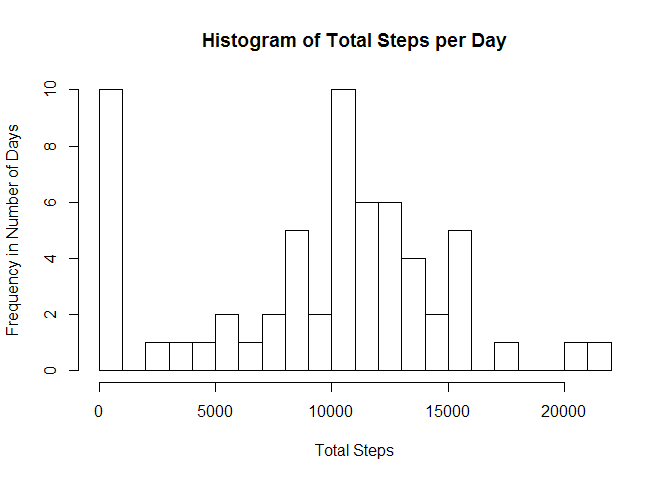
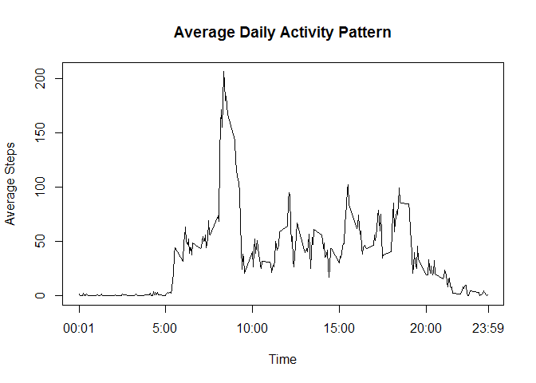
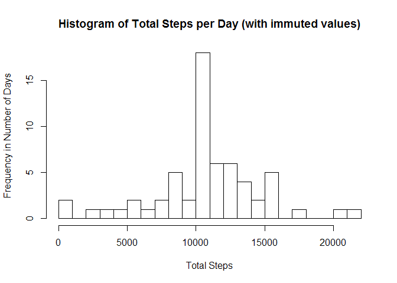
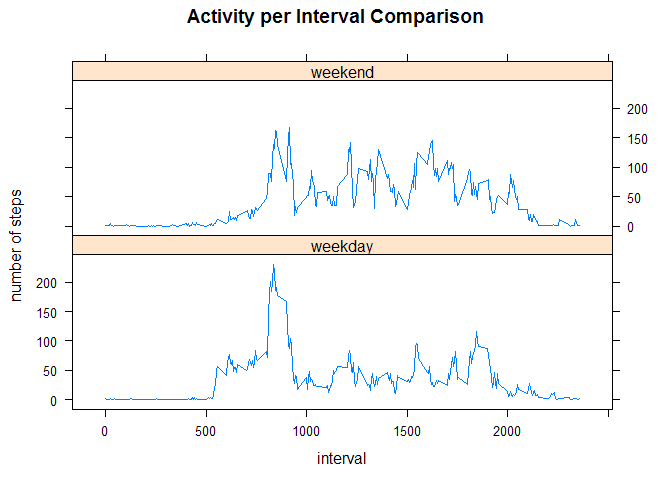

# Reproducible Research - Assignment 1
Chris Whitehead  
March 29, 2016  


## Introduction

This is the report for Assignment 1 of the Reproducible Research course in the Data Science specialization offered through Johns Hopkins Universtiy and Coursera.

## Loading and preprocessing the data


```r
## activity.csv must be in your working directory.
activity<-read.csv("activity.csv")
```
Now I can want to convert my data frame *activity* into a table so I can manipulate the data easily, using dplyr.


```r
library(dplyr)
activity<-tbl_df(activity)
```

## What is the mean total number of steps taken per day?
1. Calculate the Total number of steps taken per day.

```r
## group the table by date
grouped_by_date<-group_by(activity, date)

## create a separate table showing the total steps per day (I'm ignoring NA values at this point)
total_steps<-summarize_each(grouped_by_date, funs(sum(., na.rm=TRUE)))
total_steps$interval<-NULL ##I wanted to get rid of the interval column as it is not needed
```

2. Now I created a histogram to look at the distribution of step totals. I chose to 16 breaks because after some trial and error, this number made the chart easiest to read. It also highlight the 10 days where that are problematic for the lack of recorded steps.

```r
## create a histogram showing the distribution of total steps per day
hist(total_steps$steps, breaks=16, main="Histogram of Total Steps per Day", xlab="Total Steps", ylab="Frequency in Number of Days") 
```



3. Calculate and report the mean and median of the total number of steps taken each day.

```r
theMean<-mean(total_steps$steps, na.rm=TRUE)
theMedian<-median(total_steps$steps, na.rm=TRUE)
```
Using markdown to display the above values: The mean is **9354.23**, and the median in **10395**.

##What is the average daily activity pattern?
1. Make a time series plot of the 5-minute interval and the average number of steps taken (averaged across all days).

```r
## use dplyr to group by interval
grouped_by_interval<-group_by(activity, interval)
## create a daily trends table that shows the mean steps for each interval
daily_trends<-summarize_each(grouped_by_interval, funs(mean(., na.rm=TRUE)))
plot(daily_trends$interval, daily_trends$steps, type="l", xaxt="n", main="Average Daily Activity Pattern", xlab="Time", ylab="Average Steps")
axis(1, c(1,500, 1000, 1500, 2000,2359), c("00:01","5:00", "10:00", "15:00", "20:00","23:59")) ##Changed the x-axis so it was more intuitive.
```



2. Which 5-minute interval contains the maximum number of steps?


```r
## find the maximum
maxAverage<-max(daily_trends$steps, rm.na=TRUE)
## which interval has the max?
maxRow<-which(daily_trends$steps==maxAverage)
busyTime<-daily_trends$interval[maxRow]
## convert interval to hour:minute format for friendly reporting
busyTime<-sprintf("%04d", busyTime)
busyTime<-format(strptime(busyTime, format="%H%M"), format="%H:%M")
```

The interval with the most average steps is **08:35**.

##Imputing missing values
1. Calculate and report the total number of missing values in the dataset. Since the only column with NA values is steps, we can just total the results of is.na on the steps column.

```r
## Count NA values.
missing<-sum(is.na(activity$steps))
```
There are **2304** rows with missing values.

2. Devise a strategy for filling in all the missing values.
  + I think the best way to fill them in, will be to take the average steps for that interval as seen from the other days that do have values.
3. Create a new dataset that is equal to the orignal dataset, but with the missing data filled in.

```r
## for loop to check na then use the iterator to pull average steps from daily trends data frame
for(i in 1:nrow(activity)){
  if(is.na(activity[i,1])){
    avg_steps<-daily_trends$steps[which(daily_trends$interval==activity$interval[i])]
    activity$steps[i]<-avg_steps
  }
} 
```
4. Make a historgram and calculate the mean and median.

```r
## group the table by date
grouped_by_date2<-group_by(activity, date)

## create a separate table showing the total steps per day (I'm ignoring NA values at this point)
total_steps2<-summarize_each(grouped_by_date2, funs(sum(., na.rm=TRUE)))
total_steps2$interval<-NULL ##I wanted to get rid of the interval column as it is not needed
## create a histogram showing the distribution of total steps per day
hist(total_steps2$steps, breaks=16, main="Histogram of Total Steps per Day (with immuted values)", xlab="Total Steps", ylab="Frequency in Number of Days") 
```



```r
theMean2<-mean(total_steps2$steps)
theMedian2<-median(total_steps2$steps)
```
Using markdown to display the above values: The mean is **10766.19**, and the median in **10766.19**.

By imputing the NA's we notice both the mean and the medium go up. However, our steps are now more evenly distributed. Prior to immuting the values we had a large number of days where it looked like zero steps were taken. The histogram now makes more sense. 

## Are there difference is activity patterns between weekdays and weekends?
1. Create a new factor variable with two levels.

```r
##convert date column to date object
activity$date<-as.Date(activity$date)
##check whether it's a weekday or not and add a factor accordingly. 
Myweekdays <- c('Monday', 'Tuesday', 'Wednesday', 'Thursday', 'Friday')
activity$day<-factor((weekdays(activity$date) %in% Myweekdays), levels=c(FALSE, TRUE), labels=c('Weekend','Weekday'))
```

2. Make a panel plot

```r
library(lattice)
## Create the graph
xyplot(steps ~ interval | day, activity, type='l', layout=c(1,2), ylab="number of steps", main="Activity per Interval Comparison")
```



